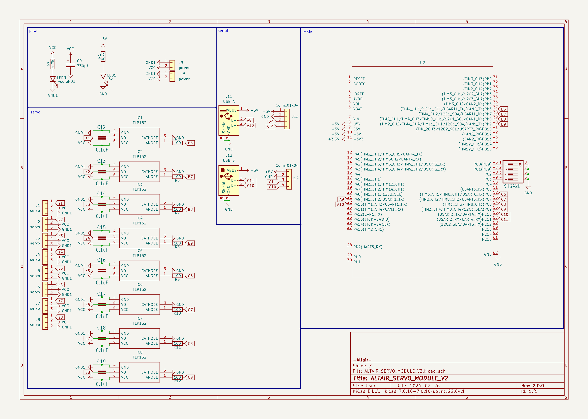
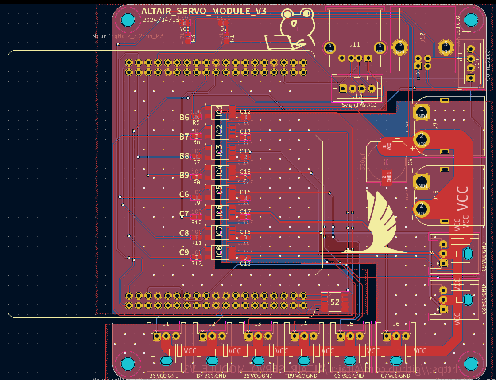

# ALTAIR_SERVO_MODULE_V3
[ALTAIR_SERVO_MODULE_V3](https://github.com/Altairu/ALTAIR_SERVO_MODULE_V3
)

## ピン情報

 * B6
 * B7
 * B8
 * B9
 * C6
 * C7
 * C8
 * C9

## 回路図

### 注意
フォトカプラはTLP152ではなくTLP2304を使うこと 

## PCB

