# **設計意図**

### 4s 渡邉大喜

---

## 1. 回路 
### ***モジュールについて***  

## 2. 運用 
### ***シリアル通信について*** 

---
# モジュール化したもの

1. サーボモジュール
2. モータードライバードライバー
3. モータードライバー(説明省略)
4. 電磁弁モジュール
5. センサーモジュール
6. 電源モジュール

---
# **サーボモジュール**
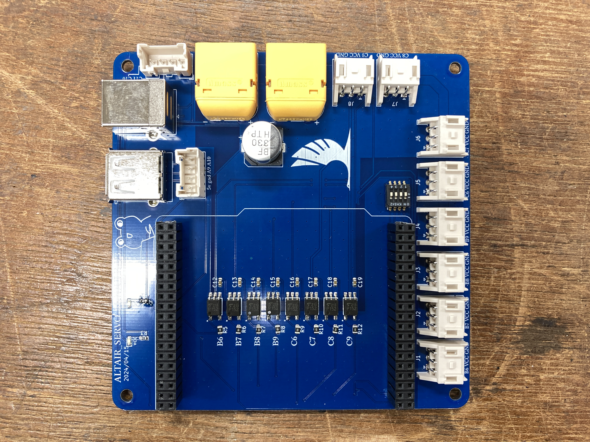

---
# **サーボモジュール**
使用ピン
B6,B7,B8,B9,C6,C7,C8,C9

---
# **サーボモジュール**

フォトカプラと呼ばれる素子を使用

---
# **フォトカプラ**
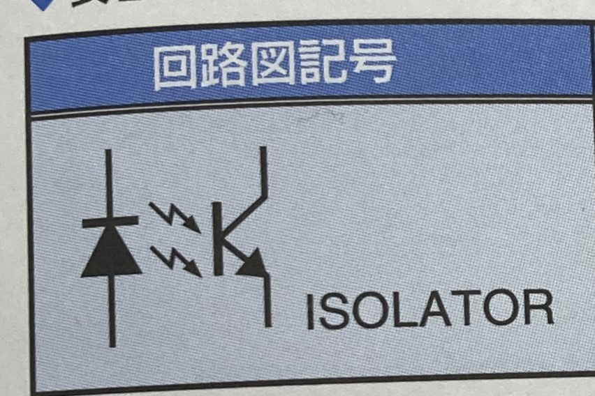
上記は回路図記号
発光素子と受光素子を一体化してモジュール化した物
入力と出力を絶縁することが出来るため
駆動する物を動かす際には使用している

---
# **フォトカプラ**
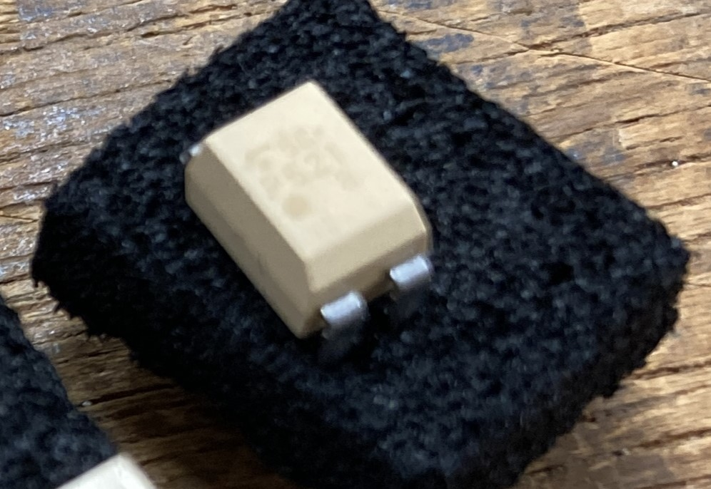
入力側は斜めになっている方
発光ダイオードとフォトトランジスタを一体化したもの

LEDを光らせそれに反応し出力側のフォトトランジスタが起動する物です

---
# **フォトカプラ**
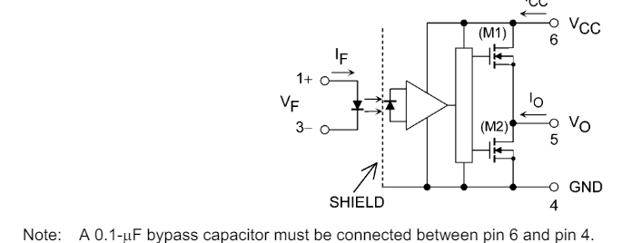
データシートに出力側に0.1μFのコンデンサをつけてねって書かれているのでつけときましょう

---
## **モータードライバードライバー**
## **(MDD)**
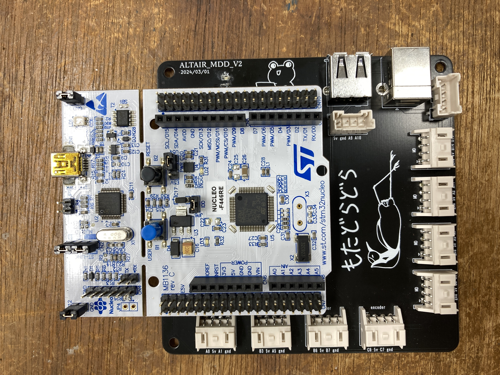

---
# **MDD**
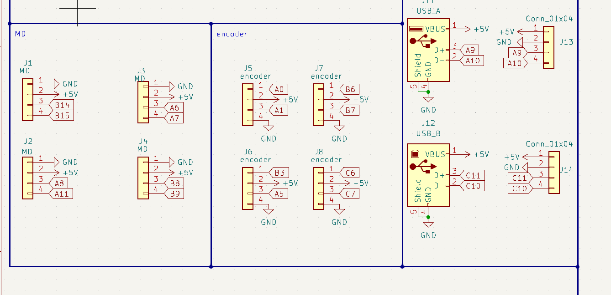
マイコンとコネクタの対応するPINを接続したもの

---
# **MDD**
## PIN配置
モーター
M1 B14,B15 TIM12 M2 A8,A11 TIM1
M3 A6,A7 TIM3 M4 B6,B9 TIM4
エンコーダー
E1 A0,A1  E2 B3,A5 
E3 B6,B7 E4 C6,C7

---
# **モータードライバー**
# **(説明省略)**
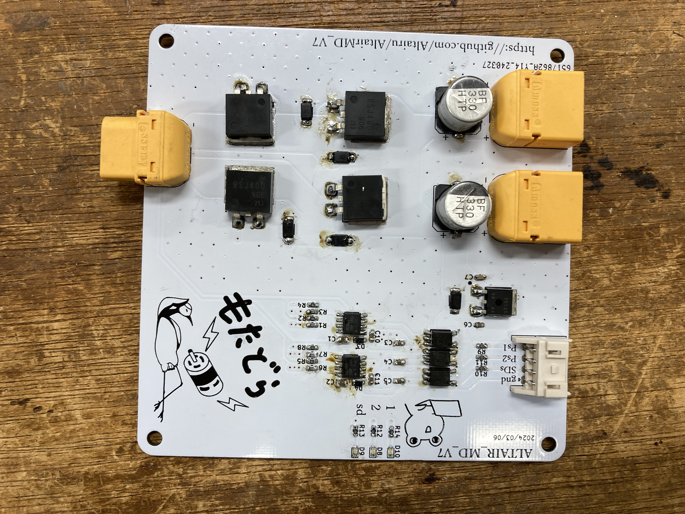

---
# **電磁弁モジュール**

電磁弁を使用し右にある電源入力に入れた電源を電磁弁に送るかを制御する物です

---
# **電磁弁モジュール**
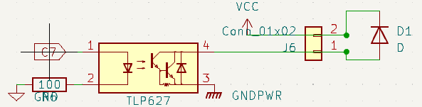
先ほど説明したフォトカプラを使用し電磁弁に電源を供給
過去資料をほとんど確認したが
基本的にs-kenではこのような回路で構成されている
(しかし，フォトカプラの後にMOSFETを挟む事を推奨します)

---
# **電磁弁モジュール**
## PIN配置
C7,C8,B6,B7,B8,B9

---
# **センサーモジュール**

MDD同様,マイコンとコネクタの対応するPINを接続
リミットスイッチ8個エンコーダー4個に対応

---
# **センサーモジュール**
## PIN配置
リミットスイッチ
A6,A7,A8,A11,B8,B9,B14,B15
エンコーダー
E1 A0,A1  E2 B3,A5 
E3 B6,B7 E4 C6,C7

---
# **電源モジュール**
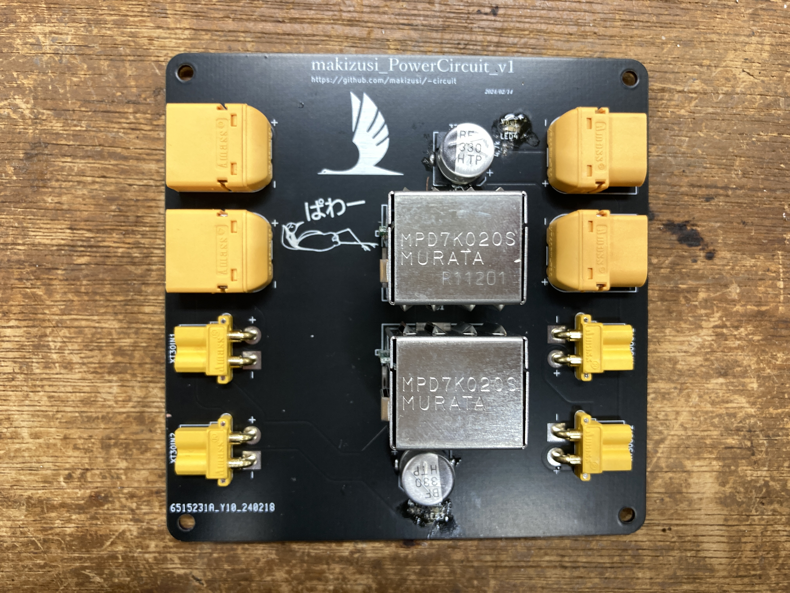
左が入力，右が出力

---
# **電源モジュール**
## DCDCコンバータ
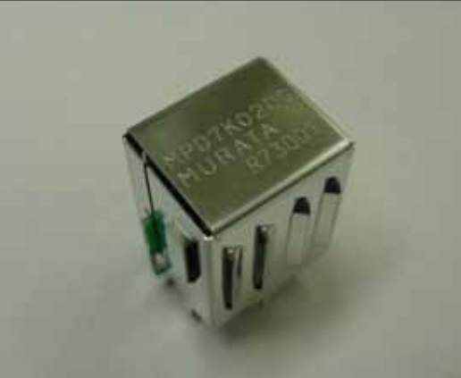
3端子レギュレータと同様に電圧を変換することのできる素子です

---
# **DC/DCコンバータ**

3端子レギュレータは熱に変換し降圧しますが，
出力電圧制御をPWM制御で行いMOSFETのスイッチングにより降圧しています

---
# **DC/DCコンバータ**
3端子レギュレータのように入力電圧と出力電圧は影響しない，原理的に発熱はデジタルスイッチングのロスだけが影響し，発熱を小さくできる

---
# **DC/DCコンバータ**
## コンデンサ
部室では電解コンデンサとセラミックコンデンサを主に使用
1.電解コンデンサ
極性ありリード線の長いほうが+
2.セラミックコンデンサ
極性なし

---
# **コンデンサ**
## 1.直流回路の電源フィルター
## 2.バイパス用

---
# **コンデンサ**
## 1.直流回路の電源フィルター
電解コンデンサを使用
部室では下のようなコンデンサを使用している

---
# **コンデンサ**
## 1.直流回路の電源フィルター
緊急時のバックアップ電源となり電圧の低下を防いでくれる使い方 数十μC~数百μC程度を使用過去に製作した基板においては3300μC以上のものを使用していることもある
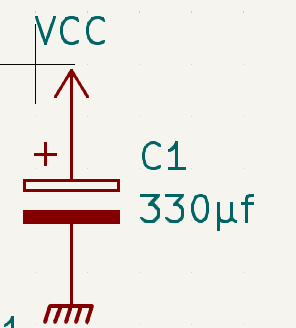

---
# **コンデンサ**
## 2.バイパス用
周波数の高いノイズ成分だけがコンデンサを通過して分離され,以降にノイズがスイッチング電源でのスイッチングノイズを取り除く用途 0.1μC程度を使用
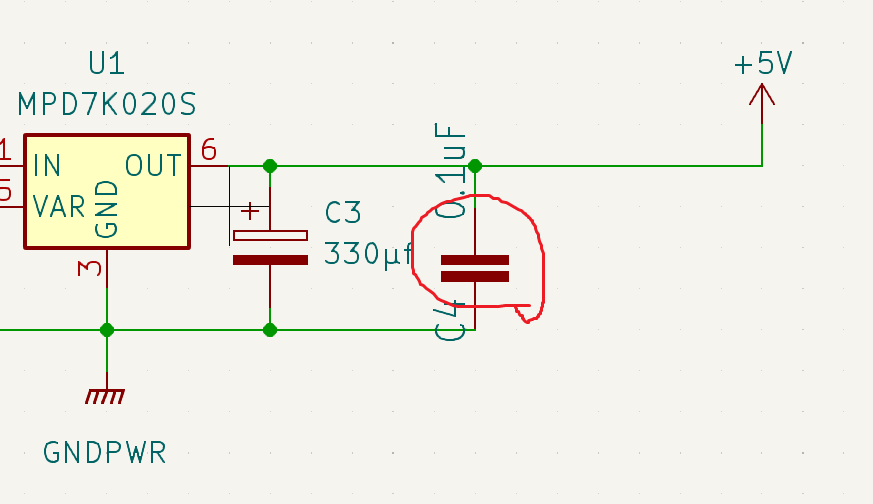

---
### **大きさ規格**
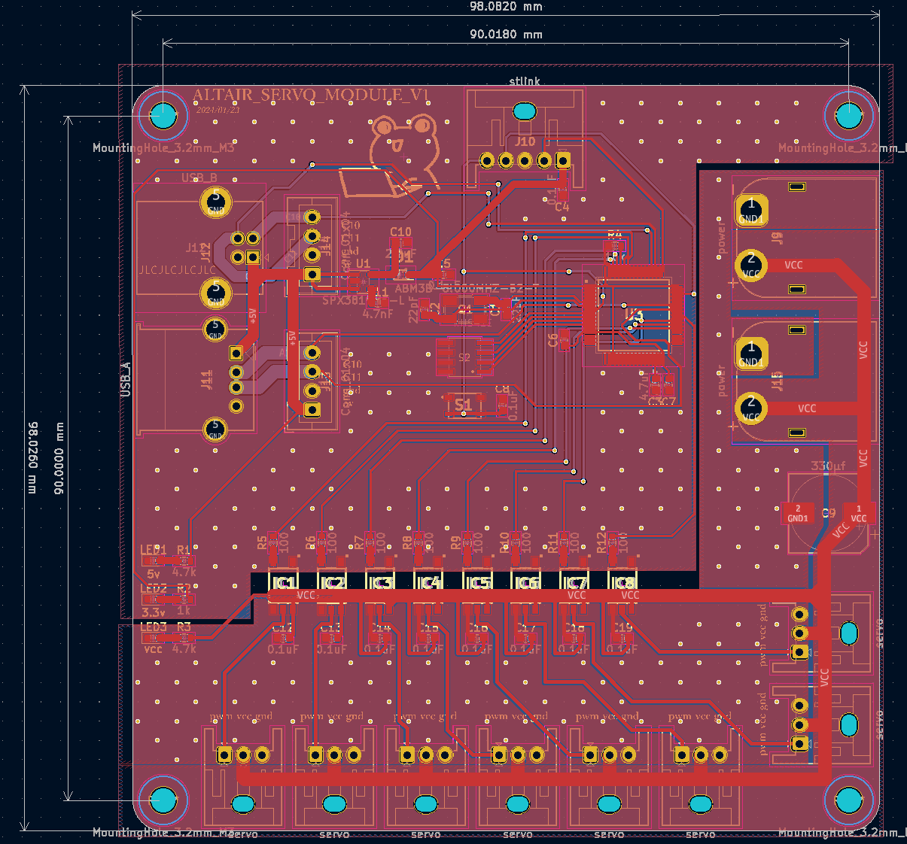
外形：約98[mm],穴：約90[mm]

---
### **通信ケーブル**

---
### **通信ケーブル**
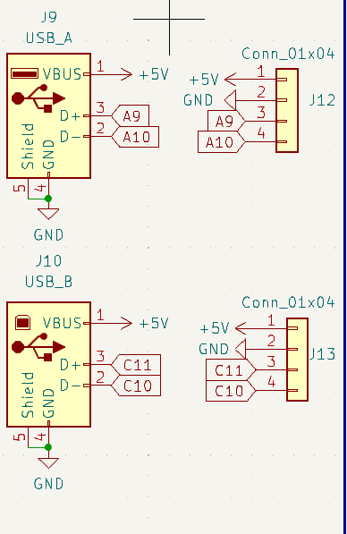
通信ケーブルに
TX(送信),RX(受信),
5V,GND
が入っているため
ケーブル1本の接続で
送受信が可能

---
### **通信ケーブル**

TX(送信)A9.C11,RX(受信)A10.C10,
5V,GND

---